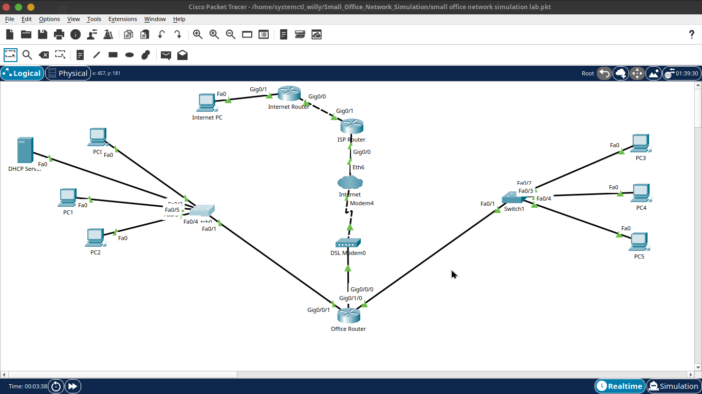
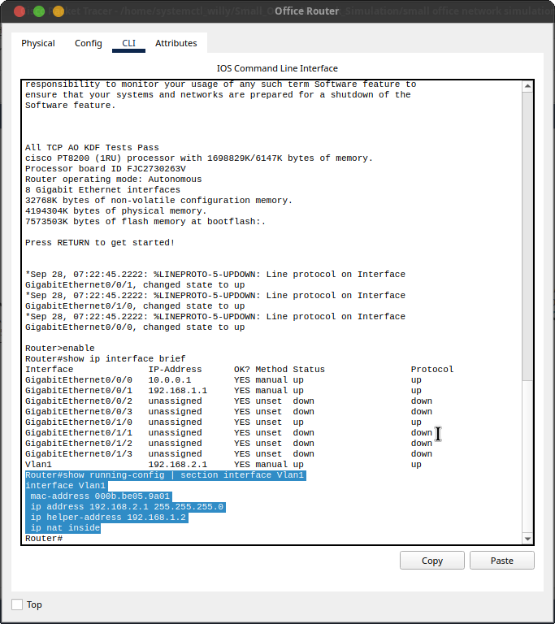
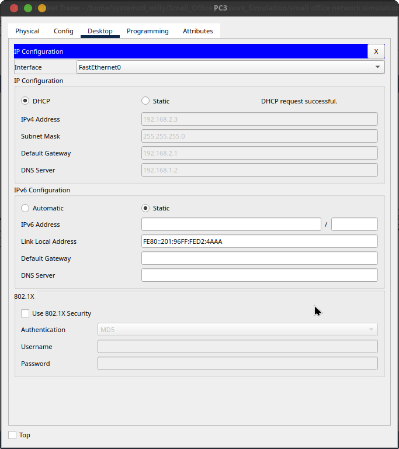
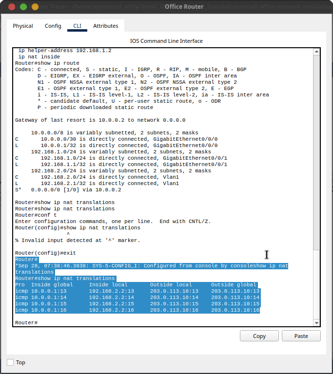
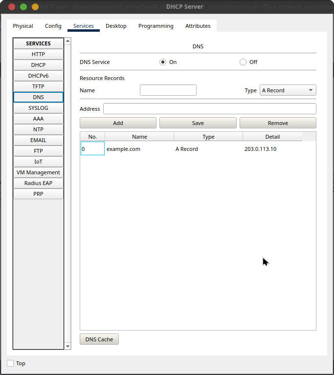
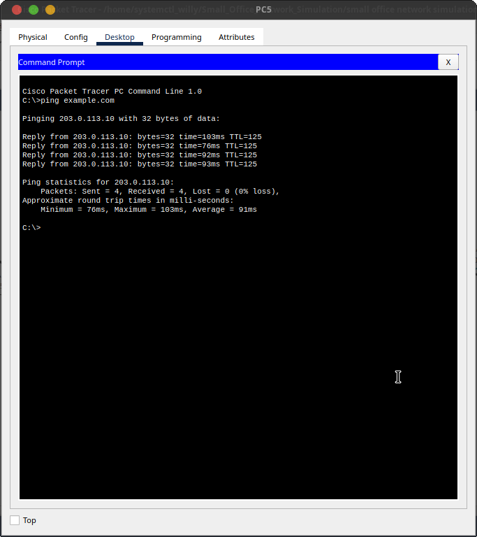

# Small Office Network Simulation — Cisco Packet Tracer

A portfolio project demonstrating the design, configuration, verification, and troubleshooting of a small-office network using Cisco Packet Tracer.

## Project objective

The lab represents a small office with two internal LANs, a centralized DHCP/DNS server, DHCP relay, IPv4 routing, a DSL-style WAN, ISP routing, NAT/PAT, and an external test network.

## Topology

Office LAN 1 (192.168.1.0/24) → Switch 1 → Office Router  
Office LAN 2 (192.168.2.0/24) → Switch 2 → Office Router  
DHCP/DNS Server (192.168.1.2) → Switch 1  
Office Router → DSL Modem → Cloud-PT → ISP Router → Internet Router → External Test PC

## Addressing plan

| Segment | Network | Key address |
|---|---|---|
| Office LAN 1 | 192.168.1.0/24 | Gateway 192.168.1.1 |
| Office LAN 2 | 192.168.2.0/24 | Gateway 192.168.2.1 |
| Office ↔ ISP | 10.0.0.0/30 | Office 10.0.0.1, ISP 10.0.0.2 |
| ISP ↔ upstream | 10.0.0.4/30 | ISP 10.0.0.5, upstream 10.0.0.6 |
| External test LAN | 203.0.113.0/24 | Gateway 203.0.113.1 |
| External test host | 203.0.113.0/24 | Host 203.0.113.10 |
| DHCP/DNS server | — | 192.168.1.2 |

## Technologies demonstrated

- IPv4 addressing and subnetting
- Layer 2 switching
- Layer 3 routing
- Centralized DHCP
- DHCP relay with ip helper-address
- Static and default routes
- Point-to-point /30 WAN addressing
- NAT/PAT overload
- Standard ACLs for NAT matching
- DNS fundamentals
- Structured troubleshooting and verification

## DHCP relay

The DHCP server is on 192.168.1.0/24 while LAN 2 clients are on 192.168.2.0/24. The Office Router relays DHCP requests on Vlan1 to 192.168.1.2, allowing one DHCP server to service both subnets.

## Routing

The Office Router has connected routes for both LANs and a default route toward the ISP at 10.0.0.2. The ISP Router has return routes for both office LANs and a default route toward the upstream Internet Router at 10.0.0.6. The upstream router has a return route toward the office WAN.

## NAT/PAT

The LAN-facing interfaces are configured as NAT inside and the WAN interface as NAT outside. ACLs match both private office networks, and NAT overload allows multiple internal clients to share the Office Router WAN-side address.

A verified translation showed an internal client such as 192.168.2.2 translated to 10.0.0.1 while reaching 203.0.113.10.

## Verification

The completed lab was verified across both LANs, the WAN path, NAT/PAT, and DNS. Tests included DHCP assignment on LAN 2, inter-LAN reachability, router-to-router connectivity, external host reachability, NAT translation, and DNS name resolution.

The external test PC initially had an incorrect default gateway; correcting it restored end-to-end connectivity. This provided a useful return-routing troubleshooting case.

## Troubleshooting lessons

### DHCP across subnets

A DHCP pool alone does not make a remote subnet receive leases. DHCP relay is required when the centralized server is on another subnet.

### Return routing

Successful outbound routing is not enough. The return path must also exist; a wrong external default gateway caused an end-to-end failure that was resolved by correcting the gateway.

### Routing versus NAT

Routing decides where packets go. NAT/PAT changes the source identity used by private hosts when they cross the office WAN boundary.

### DNS versus connectivity

A successful ping to an IP address does not prove hostname resolution. DNS was tested separately from raw IP connectivity.

## Evidence Gallery

### Final topology

### DHCP relay

### LAN 2 DHCP client

### NAT/PAT verification

### DNS verification

For the complete evidence set, see the [evidence directory](evidence/) and the [evidence checklist](evidence/EVIDENCE-CHECKLIST.md).

> 203.0.113.0/24 is a simulated external/test network for Packet Tracer. It demonstrates Internet-style routing and NAT behavior inside the lab; it is not a claim of real Internet access.

## Portfolio wording

Designed and implemented a Cisco Packet Tracer small-office network simulation with segmented LANs, centralized DHCP, DHCP relay, IPv4 routing, a DSL-style WAN and ISP path, default and return routing, NAT/PAT, DNS fundamentals, and structured end-to-end verification and troubleshooting.

## Repository structure

README.md
configs/
diagrams/
docs/
evidence/
packet-tracer/
screenshots/
